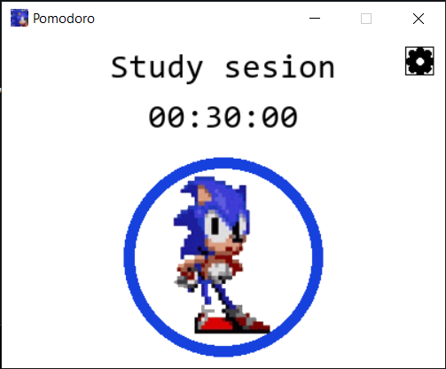
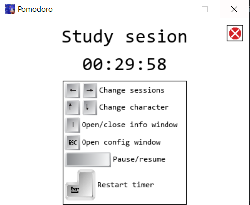
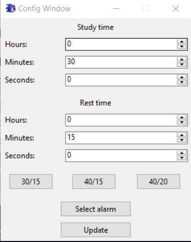

# Pomodoro Timer

A simple Pomodoro timer application for managing study and rest sessions.
The core idea is minimal pomodoro timer taking the minimal space on the screen.
There's also animations with sonic sprites.

## Features

- Two configurable session types: Study and Rest
- Session navigation with arrow keys 
- Timer control with spacebar (pause and resume)
- Customizable session durations via pop up window by pressing ESC
- Sonic animations. Running in study session. Waiting in rest session. There is also animation with Shadow, Tails and Super Sonic
- Option for changing the character on the screen
- Dissapiring circle indicating how much time until timer stops
- Option for selecting an audio file wich will be played after the session is finished
- Button that can open a "window" for info about keyboard controls

## Controls

- **Left/Right Arrow Keys**: Switch between Study and Rest sessions
- **Up/Down Arrow Keys**: Change character
- **Spacebar**: Start/Stop timer
- **Escape**: Open the configuration window
- **Enter**: Restart Timer and load updated times stamps from configuration file
- **I**: Open/Close window for keyboard controls

## Changing Time Stamps

1. Press ESCAPE to open configuration window
2. Edit session durations as needed. **NOTE: Time greater than 24 hours will be reduced to 24 hours**
3. There 3 buttons than change states of the spinboxes. They represent 3 default time stamps.
4. Button **"Select alarm"** opens file dialog that allows the user to choose .mv or .mp3 file for alarm
5. Changes are only made after clicking the **"Update"** button
**NOTE: When the popup window has been opened, the state of the timer in main window will be lost.**

if ```config.json``` is deleted, program generate this file with default configuration.

## Required packages

- python 3.x
- Install pygame module with
```bash
pip install pygame
```

## How to run

### User can install the apllication with ```config.json```

### or run it in the terminal

### For linux distros
```bash
python3 main.py
```

### For Windows
```bash
python main.py
```

## Screenshots
### Main Window

### Keyboard Controls Info Window

### Config Window
