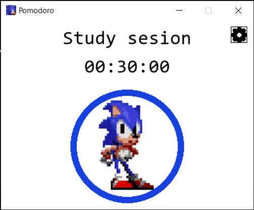
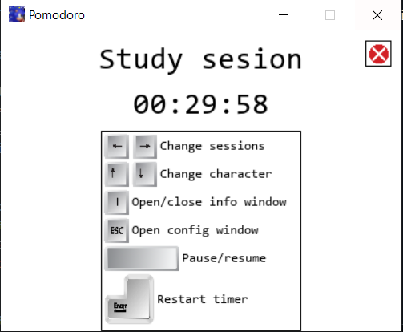
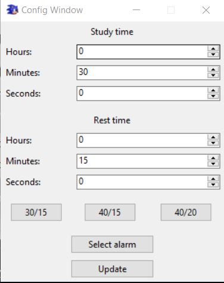

# Pomodoro Timer

A simple Pomodoro timer application for managing study and rest sessions.
The core idea is minimal pomodoro timer taking the minimal space on the screen.
There's also animations with sonic sprites.

## Features

Two configurable session types: Study and Rest
Session navigation with arrow keys 
Timer control with spacebar (pause and resume)
Customizable session durations via pop up window by pressing ESC
Sonic animations. Running in study session. Waiting in rest session. There is also animation with Shadow, Tails and Super Sonic
Option for changing the character on the screen
Dissapiring circle indicating how much time until timer stops
Option for selecting an audio file wich will be played after the session is finished
Button that can open a "window" for info about keyboard controls

## Controls

Left/Right Arrow Keys: Switch between Study and Rest sessions
Up/Down Arrow Keys: Change character
Spacebar: Start/Stop timer
Escape: Open the configuration window
Enter: Restart Timer and load updated times stamps from configuration file
I: Open/Close window for keyboard controls

## Installation and Setup

Create a virtual environment for Windows:
```powershell
python -m venv venv
.\venv\Scripts\activate
```

Create a virtual environment for Linux/macOS:
```bash
python3 -m venv venv
source venv/bin/activate
```

## Required packages

python 3.x
Install pygame module with:
```bash
pip install pygame
```

## How to run

For linux distros:
```bash
python3 main.py
```

For Windows:
```bash
python main.py
```

## Changing Time Stamps

- Press ESCAPE to open configuration window
- Edit session durations as needed. NOTE: Time greater than 24 hours will be reduced to 24 hours
- Use the Preset Dropdown to quickly select default time configurations
- Button "Select alarm" opens file dialog that allows the user to choose .wav or .mp3 file for alarm
- Changes are only made after clicking the `Update Config File` button
- NOTE: To update the timer after writing the changes press ENTER in the main window.

if config.json is deleted, program generate this file with default configuration.

## Screenshots

- Main Window


- Keyboard Controls Info Window


- Config Window (This screenshot is from previous version)
